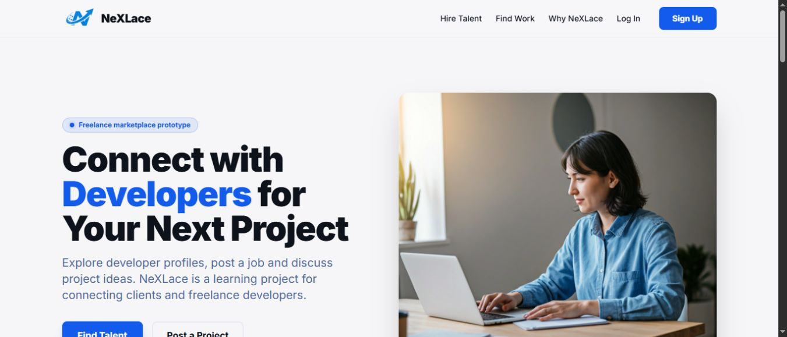

# NeXLace

A freelance marketplace project for clients and developers. Clients can post jobs and browse developer profiles; developers can apply for work, receive invitations and communicate through the site.

This project helped me work through a larger PHP application: authentication, relational data, asynchronous requests and workflows that connect several screens.

[Architecture](docs/architecture.md) · [Local setup](docs/setup.md) · [Manual verification](Online_Job_Portal_System_Testing_Validation.md)



## Main features

- Registration and sign-in using PHP sessions and hashed user passwords.
- Developer profiles with skills, experience and portfolio information.
- Job posting, search, applications, likes and invitations.
- Conversations with file attachments and notification updates through Server-Sent Events.
- Profile and session management, plus a separate administration area.
- An optional Gemini-powered assistant and a Node/Express email OTP service.

The billing page is an interface, not a completed payment or escrow integration. The project is a development prototype; see the setup and security limitations below.

## Stack

| Part | Technologies |
| --- | --- |
| Pages and API | PHP, HTML, JavaScript, CSS, Tailwind via CDN |
| Database | MySQL with PDO and prepared queries |
| Authentication | PHP sessions, password hashing, CSRF helpers |
| Notifications | Server-Sent Events with database polling on the server |
| Email service | Node.js, Express, Nodemailer |
| Assistant | Gemini API called through a PHP proxy |

There is a Supabase client file in the repository, but the current PHP application's persistence is MySQL. It is not a Supabase-backed application.

## Running locally

Use PHP 8+, MySQL and a local web server such as Apache/Laragon. The PHP extensions `pdo_mysql`, `fileinfo` and `curl` are used by the application. Node.js is needed only for the optional email service and the root tooling.

```sh
git clone https://github.com/itsshashank09/NeXLace.git
cd NeXLace
```

Set `DB_HOST`, `DB_PORT`, `DB_NAME`, `DB_USER` and `DB_PASSWORD` in the PHP server's environment. The defaults target a local `nexlace` database on port 3306. See [setup](docs/setup.md) for PHP hosting, email configuration and the optional assistant.

**Database setup is currently incomplete in the repository.** `setup_database.php` refers to `nexlace_schema.sql`, which is not checked in. A matching schema is needed to exercise the authenticated workflows. The public landing page can be viewed without it; running the setup script will not reconstruct the missing schema.

## Code worth reading

- [`api/login.php`](api/login.php): session login and failed-attempt handling.
- [`config/csrf.php`](config/csrf.php): session-bound CSRF tokens.
- [`api/post_job.php`](api/post_job.php) and [`api/apply_job.php`](api/apply_job.php): job and application workflows.
- [`api/send_message.php`](api/send_message.php): message and attachment handling.
- [`api/notifications_stream.php`](api/notifications_stream.php): an authenticated SSE stream that releases the PHP session lock.

## Structure

```text
api/             JSON endpoints and notification stream
config/          Database, CSRF, headers and assistant configuration
includes/        Shared authentication, database and UI helpers
admin_panel/     Administration pages and authentication
nodemailer/      Optional email OTP service
js/, css/        Browser behaviour and styles
assetes/         Existing branding and images
docs/            Setup, architecture and public-page screenshot
*.php, *.html    Application and public pages
```

## Current limitations

The next priorities are a versioned database schema, repeatable integration checks and consistent authorization. Some schema changes still happen during requests. Email OTP verification is handled separately from PHP registration and needs server-side binding before it can be treated as an authentication guarantee. The admin authentication code still needs a migration from its legacy plaintext credential handling.

The assistant now reads its key from the environment. A key was previously committed: it must be revoked or rotated at the provider, since changing the current file does not remove it from Git history. Do not use real accounts, private documents or production credentials when trying this prototype.

## Documentation

[Project notes](NeXLace_Capstone_Report.md), [OTP setup](OTP_SERVER_SETUP.md), [attachment notes](FILE_ATTACHMENT_FIX.md) and the [development roadmap](ROADMAP_96_DAYS.md) provide more detail. The verification document records what can be checked; it does not claim unrecorded performance or load-test results.

No project-wide open-source licence is supplied. The licence labels in npm manifests do not establish the licence for the entire application.
